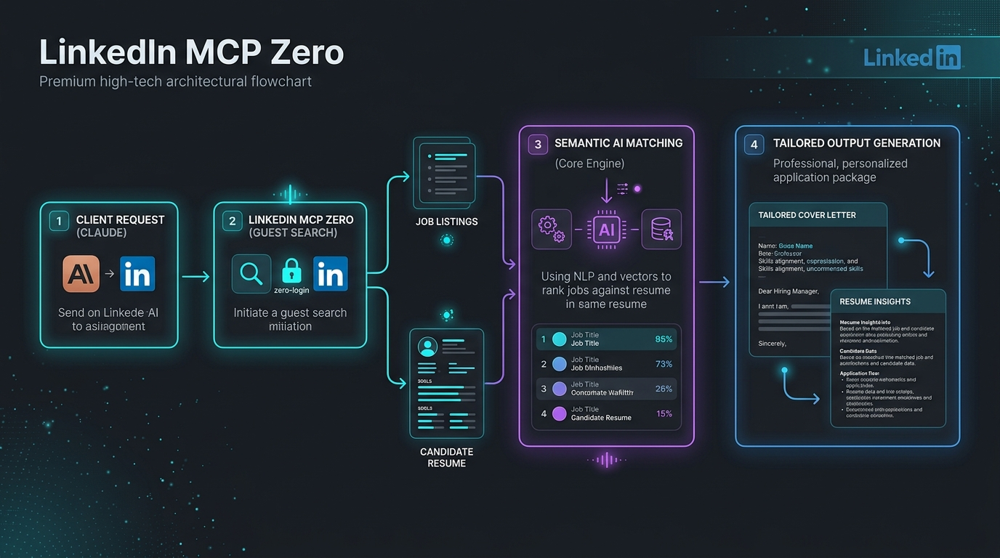

<div align="center">

```text
██╗     ██╗███╗   ██╗██╗  ██╗███████╗██████╗ ██╗███╗   ██╗
██║     ██║████╗  ██║██║ ██╔╝██╔════╝██╔══██╗██║████╗  ██║
██║     ██║██╔██╗ ██║█████╔╝ █████╗  ██║  ██║██║██╔██╗ ██║
███████╗██║██║ ╚████║██║  ██╗███████╗██████╔╝██║██║ ╚████║
             MCP ZERO - public-first LinkedIn intelligence
```

# LinkedIn MCP Zero

**A public-first MCP server for LinkedIn jobs, resumes, matching, alerts, exports, and opt-in read-only browser intelligence.**

No Docker required · Claude Desktop ready · Claude Code ready · Low-RAM friendly · PyPI published

[](https://pypi.org/project/linkedin-mcp-zero/)
[](https://www.python.org/)
[](LICENSE)
[](https://modelcontextprotocol.io/)
[](https://codecov.io/gh/SanthaKumar-K-2004/linkedin-mcp-zero)
[](https://mypy-lang.org/)

</div>

---

## 🎨 System Flow



### 🔌 Works With
- ✅ **Claude Desktop** (Fully verified)
- ✅ **Claude Code** (Fully verified)
- ✅ **Cursor** (Fully verified)
- ✅ **VS Code + Copilot** (Fully verified)
- ✅ **Cline / Roo Code** (Fully verified)
- ✅ **Any standard Stdio/HTTP MCP client**

---

## 📊 Feature Comparison
Compare LinkedIn MCP Zero against the next most popular alternatives:

| Feature | stickerdaniel (2.3k★) | Other MCP Servers | **LinkedIn MCP Zero (10/10)** |
|---|:---:|:---:|:---:|
| **Zero-Login Public Tools** | ❌ None | ⚠️ 0-2 tools | **✅ 30+ Public Tools** |
| **Semantic AI Resume Matching** | ❌ None | ❌ None | **✅ Yes (TF-IDF & LLM-guided)** |
| **Local DOCX/PDF Parsing** | ❌ None | ❌ None | **✅ Yes (Docling & PyMuPDF)** |
| **Iterative Progress Reporting** | ❌ None | ❌ None | **✅ Yes (MCP `Context.report_progress`)** |
| **Wired OpenTelemetry Traces** | ❌ None | ❌ None | **✅ Yes (Batch OTel Tracing)** |
| **Enterprise OAuth 2.1 Security** | ❌ None | ❌ None | **✅ Yes (Remote Introspection Middleware)** |
| **One-Click Diagnostic CLI** | ❌ None | ❌ None | **✅ Yes (`--doctor` verification)** |
| **Interactive CLI setup** | ❌ None | ❌ None | **✅ Yes (Automated Configurator)** |
| **Zero-Configuration Setup** | ❌ None | ⚠️ Complex docker | **✅ Yes (Pure Python / uvx direct)** |

---

## Install In One Command

| Client | Command |
|---|---|
| Claude Desktop | `uvx --refresh-package linkedin-mcp-zero linkedin-mcp-zero --install-client claude-desktop` |
| Claude Code | `uvx --refresh-package linkedin-mcp-zero linkedin-mcp-zero --install-client claude-code` |
| Cursor | `uvx linkedin-mcp-zero --install-client cursor` |
| VS Code | `uvx linkedin-mcp-zero --install-client vscode` |
| Any stdio client | `uvx linkedin-mcp-zero` |

```bash
uvx linkedin-mcp-zero --doctor
```

Verify after install:

```bash
uvx --refresh-package linkedin-mcp-zero linkedin-mcp-zero --verify-client claude-desktop
```

Browser mode:

```bash
uvx --refresh-package linkedin-mcp-zero linkedin-mcp-zero --install-client claude-desktop --with-extra browser
```

## Tool Inventory

### Default Tools: 30 Working

These work without LinkedIn login or browser setup.

| # | Tool | Feature | Risk |
|---:|---|---|---|
| 1 | `search_jobs` | Search public LinkedIn jobs | Public no-login |
| 2 | `search_jobs_multi` | Multi-board search; LinkedIn fallback by default | Public no-login |
| 3 | `get_job_details` | Full public job details | Public no-login |
| 4 | `get_company_jobs` | Public jobs for a company | Public no-login |
| 5 | `get_company_profile` | Company signals inferred from public jobs | Public no-login |
| 6 | `search_companies` | Company discovery from public job data | Public no-login |
| 7 | `get_job_salary` | Salary extraction from job detail pages | Public no-login |
| 8 | `get_job_trends` | Role/location hiring trends | Public no-login |
| 9 | `get_industry_insights` | Market signals for an industry | Public no-login |
| 10 | `search_jobs_advanced` | Job search with filters | Public no-login |
| 11 | `analyze_resume` | Local PDF/DOCX/text resume parsing | Local |
| 12 | `get_resume_insights` | Local skill gaps and suggestions | Local |
| 13 | `match_jobs_to_resume` | Rank public jobs against a resume | Local/public |
| 14 | `compare_jobs` | Compare selected jobs | Local/public |
| 15 | `export_jobs` | Export jobs to CSV/JSON/XLSX | Local |
| 16 | `save_job_alert` | Save a recurring search | Local |
| 17 | `get_saved_alerts` | List saved searches | Local |
| 18 | `check_saved_alerts` | Run alerts and find new matches | Local/public |
| 19 | `get_engine_status` | Runtime, engine, token, cache status | Local |
| 20 | `get_help` | Tool documentation | Local |
| 21 | `get_usage_stats` | Local response-size/token estimates | Local |
| 22 | `get_tool_usage_summary` | Aggregate local usage by tool | Local |
| 23 | `reset_usage_stats` | Clear local usage metrics | Local |
| 24 | `smart_match_jobs` | AI-powered job matching using client LLM | Local/public |
| 25 | `generate_cover_letter` | Tailored cover letter using client LLM | Local/public |
| 26 | `analyze_salary_offer` | AI-powered salary analysis using client LLM | Local/public |
| 27 | `personalized_job_hunt` | Interactive job search preferences | Local/public |
| 28 | `confirm_export` | Export jobs with user confirmation | Local |
| 29 | `get_resume_insights_advanced` | Advanced AI-powered resume insights | Local |
| 30 | `deep_industry_analysis` | Full industry analysis with progress updates | Local/public |

### Browser Tools: +11

Enable with `--with-extra browser` or `--enable-browser`. These are read-only,
but they use your logged-in browser session.

| # | Tool | Feature |
|---:|---|---|
| 31 | `get_my_profile` | Read your profile |
| 32 | `get_person_profile` | Read a public/person profile page |
| 33 | `search_people` | People search through browser |
| 34 | `get_my_connections` | Read your connection list |
| 35 | `get_inbox` | Recent conversations list |
| 36 | `get_conversation` | Read a conversation thread |
| 37 | `get_feed` | Read home feed posts |
| 38 | `get_notifications` | Read notifications |
| 39 | `get_sidebar_profiles` | Suggested/sidebar profiles |
| 40 | `get_company_employees` | Company people page |
| 41 | `check_session` | Check CDP/login readiness |

### Gated Private-Risk Tool: +1

| # | Tool | Feature |
|---:|---|---|
| 42 | `get_profile_voyager` | Voyager/private API placeholder, disabled by default |

Default mode exposes **30 usable tools**: 29 core local/public tools plus
`search_jobs_multi`, which falls back to LinkedIn-only results unless the
`multi` extra is installed. Browser tools appear only with `--enable-browser` or
`--with-extra browser` in an installed client config. Voyager/private API mode is
hidden unless explicitly enabled.

Tool counts:

| Mode | Exposed Tools | Notes |
|---|---:|---|
| Default | 30 | Safe local/public tools; no LinkedIn login required |
| Browser enabled | 41 | Adds 11 read-only browser tools; needs Chrome/CDP login |
| Browser + Voyager | 42 | Adds gated private-API placeholder |

## Safety Model

| Mode | Label | Account Risk |
|---|---|---|
| Local resume/alerts/exports | `local_zero_account_risk` | None |
| Public no-login job data | `public_no_login_read_only` | No LinkedIn login required |
| Browser tools | `browser_readonly_account_risk` | Opt-in account risk |
| Voyager/private API | `disabled_private_api_risk` | Disabled by default |

No tool posts, likes, connects, follows, applies, or sends messages.

## Browser Mode

Install browser dependencies into the isolated `uvx` runtime:

```bash
uvx linkedin-mcp-zero --install-client claude-desktop --with-extra browser
```

Start Chrome with remote debugging and log in manually:

```bash
google-chrome --remote-debugging-port=9222
```

Then call `check_session` from your MCP client.

Global Playwright installs do not count for `uvx`; use `--with-extra browser`.

## Token Usage Tracking

Claude Desktop has no built-in per-MCP token counter. This server provides a
privacy-safe tracker instead:

- Estimated tokens: `ceil(response_chars / 4)`, always on.
- Exact-style counts: optional Anthropic `/v1/messages/count_tokens`.
- Full tool responses are not stored in the metrics database.
- Exact-style counting sends the counted response text to Anthropic only when
  `ANTHROPIC_API_KEY` and `LINKEDIN_MCP_EXACT_TOKEN_COUNT=true` are both set.

Enable exact-style counting:

```bash
ANTHROPIC_API_KEY=sk-ant-... LINKEDIN_MCP_EXACT_TOKEN_COUNT=true uvx linkedin-mcp-zero
```

Use a different token-count model if needed:

```bash
LINKEDIN_MCP_TOKEN_COUNT_MODEL=claude-sonnet-4-5
```

Usage tools:

```text
get_usage_stats
get_tool_usage_summary
reset_usage_stats
```

Avoid terminal transcript logging as a token strategy; it can expose private
profile, inbox, resume, or job data.

## Client Config

Print without editing files:

```bash
uvx linkedin-mcp-zero --print-config --client claude-desktop
uvx linkedin-mcp-zero --print-config --client vscode
```

Claude Desktop and Cursor use:

```json
{
  "mcpServers": {
    "linkedin-zero": {
      "command": "/absolute/path/to/uvx",
      "args": ["linkedin-mcp-zero"]
    }
  }
}
```

VS Code uses:

```json
{
  "servers": {
    "linkedin-zero": {
      "command": "/absolute/path/to/uvx",
      "args": ["linkedin-mcp-zero"]
    }
  }
}
```

## Doctor

```bash
uvx linkedin-mcp-zero --doctor
uvx linkedin-mcp-zero --doctor --json
```

Checks OS, Python, RAM, disk, Chrome, CDP URL, display state, optional extras,
and recommended mode.

## Development

```bash
uv sync --extra dev
uv run --extra dev ruff check .
uv run --extra dev pytest
uv build
```

Publish only the new version files:

```bash
UV_PUBLISH_TOKEN=... uv publish dist/linkedin_mcp_zero-0.3.2*
```
